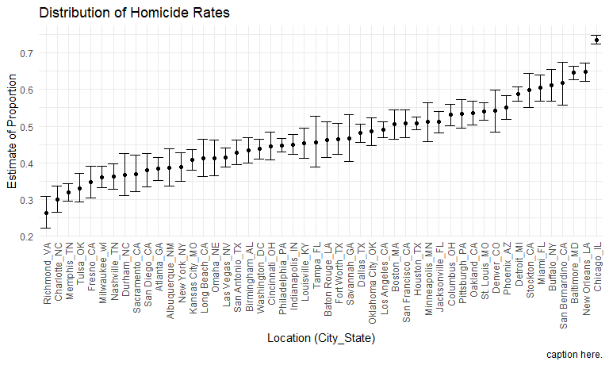
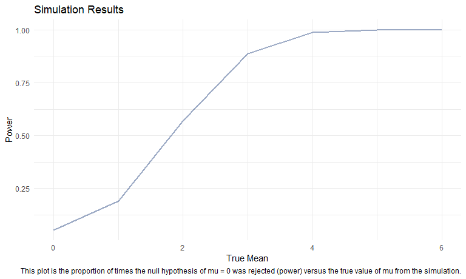
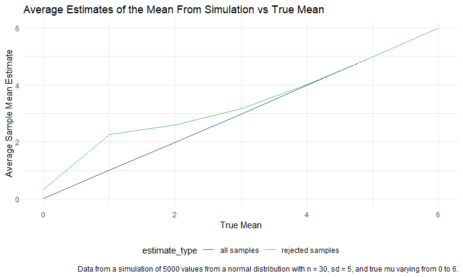

Homework 5 - Iteration
================
Sydney Ng (uni: sn2863)
Due 11/18/2020 by 10:00 pm ET

### Problem 1

``` r
homicide_df <-
  read_csv("./homicide-data.csv") %>%
  mutate(
    city_state = str_c(city, state, sep = "_"),
    resolved = case_when(
      disposition == "Closed without arrest" ~ "Unsolved",
      disposition == "Open/No arrest" ~ "Unsolved",
      disposition == "Closed by arrest" ~ "Resolved"
    )
  ) %>%
  select(city_state, resolved) %>%
  filter(city_state != "Tulsa_AL")
```

    ## Parsed with column specification:
    ## cols(
    ##   uid = col_character(),
    ##   reported_date = col_double(),
    ##   victim_last = col_character(),
    ##   victim_first = col_character(),
    ##   victim_race = col_character(),
    ##   victim_age = col_character(),
    ##   victim_sex = col_character(),
    ##   city = col_character(),
    ##   state = col_character(),
    ##   lat = col_double(),
    ##   lon = col_double(),
    ##   disposition = col_character()
    ## )

``` r
aggregate_df <-
  homicide_df %>%
  group_by(city_state) %>%
  summarize(
    homicide_total = n(),
    homicide_unsolved = sum(resolved == "Unsolved")
  )
```

    ## `summarise()` ungrouping output (override with `.groups` argument)

Can we do a test for proportions for a specific city?

``` r
prop.test(
  aggregate_df %>% filter(city_state=="Baltimore_MD") %>% pull(homicide_unsolved),
  aggregate_df %>% filter(city_state=="Baltimore_MD") %>% pull(homicide_total)) %>%
  broom::tidy()
```

    ## # A tibble: 1 x 8
    ##   estimate statistic  p.value parameter conf.low conf.high method    alternative
    ##      <dbl>     <dbl>    <dbl>     <int>    <dbl>     <dbl> <chr>     <chr>      
    ## 1    0.646      239. 6.46e-54         1    0.628     0.663 1-sample~ two.sided

Iterate:

``` r
prop_results <-
  aggregate_df %>%
  mutate(
    prop_tests = map2(.x = homicide_unsolved, .y = homicide_total,
                      ~prop.test(x = .x, n = .y)),
    tidy_tests = map(.x = prop_tests, ~broom::tidy(.x))
  ) %>%
  select(-prop_tests) %>%
  unnest(tidy_tests) %>% # unpacks the prop.test results as their own columns
  select(city_state, estimate, conf.low, conf.high)

prop_results %>%
  mutate(city_state = fct_reorder(city_state, estimate)) %>%
  ggplot(aes(x = city_state, y = estimate)) +
  geom_point() +
  theme(axis.text.x = element_text(angle = 90, vjust=0.5, hjust=1)) +
  geom_errorbar(aes(ymin=conf.low, ymax=conf.high)) +
  labs(
    title = "Distribution of Homicide Rates",
    x = "Location (City_State)",
    y = "Estimate of Proportion",
    caption = "caption here."
  )
```



### Problem 2 Longitudinal Study

``` r
path_df <- tibble(path = list.files("longitudinal_data")) %>%
  separate(path, c("arm", "subject_id", "file"), convert = TRUE,
           remove = TRUE) %>%
  select(-file) %>%
  mutate(
    path = str_c("longitudinal_data/", list.files("longitudinal_data")),
    data = map(.x = path, ~read_csv(.x))
    ) %>%
  select(-path) %>%
  unnest(data)

tidy_df <-
  path_df %>%
  pivot_longer(week_1:week_8, 
               names_prefix = "week_",
               names_to = "week", 
               values_to = "observation") %>%
  mutate(week = as.numeric(week))
```

After combining all the csv files together and tidying the dataset, we
have 160 observations in our dataset. There are 4 columns including the
arm that the subject is in, the ID of the subject within the arm, and
the week and corresponding observation.

**Spaghetti plot showing observations over-time.**

``` r
tidy_df %>%
  ggplot(aes(x=week, y=observation, group=subject_id)) +
  facet_grid(~arm)+
  theme(legend.position = "none") +
  scale_color_manual(values=c("#39568CFF", "#55C667FF")) +
  geom_point(aes(color=arm), alpha = 0.5) +
  geom_line(aes(color=arm), alpha = 0.5) +
  labs(
    title = "Spaghetti Plot of Longitudinal Data",
    x = "Week",
    y = "Value in Units of Observation",
    caption = "A two-panel spaghetti plot of observations of each subject from the control and experimental arms over time."
  )
```


Looking at the two panels of the spaghetti plot, we see that the control
group generally has more of a flat trend over the 8 weeks of
observation. The experimental group has an increasing trend in the units
of observation over the 8 weeks of observation. It seems like both
groups start around the same points, so this indicates that the
experimental treatment shows evidence of an effect, whereas the control
group does not. Finally, looking at the general spread of the lines, it
seems like both groups have similar variability among subjects (just
visually speaking, though).

### Problem 3 Simulation

``` r
sim_t <- function(mu){
  sim_data <- tibble(
    tibble(
      true_mu = mu, # decided to have the true mean in the tibble
      x = rerun(5000, rnorm(n=30, mean=mu, sd=5))
    )) %>%
  mutate(
    t_tests = map(.x = x, ~t.test(x=.x, mu=0)),
    tidy_t = map(.x = t_tests, ~broom::tidy(.x))
    ) %>%
    select(-t_tests) %>%
    unnest(tidy_t) %>%
    select(true_mu, estimate, p.value)
}

output <- sim_t(mu=0) # doing this for mu=0 before repeating

for (i in 1:6){
  temp <- sim_t(i)
  output <- bind_rows(output, temp) # repeating for values of mu = 1 to 6
}
```

**Plot to show proportion of times the null was rejected vs true value
of the mean, mu.**

``` r
decision_df <-
  output %>%
  mutate(
    decision = case_when(
      p.value >= 0.05 ~ "fail to reject",
      p.value < 0.05 ~ "reject")
  )

decision_df %>%
  filter(decision == "reject") %>%
  group_by(true_mu) %>%
  summarize(power = n()/5000) %>%
  ggplot(aes(x = true_mu, y = power)) +
  geom_line(color = "#39568CFF", size = 1, alpha=0.5) +
  labs(
    title = "Simulation Results",
    x = "True Mean",
    y = "Power",
    caption = "This plot is the proportion of times the null hypothesis of mu = 0 was rejected (power) versus the true value of mu from the simulation."
  )
```



The association between effect size and power is that they are directly
related – i.e., the greater the effect size, the greater the power of
our study. This is because if we have a true value that is further away
from our null hypothesis value, then we would be more likely to reject
the null. Hence, power increases, as seen in the plot.

**Plot showing the average estimate of all samples and the average
estimate of mu only in samples for which the null was rejected vs the
true value of mu.**

``` r
estimate_df <-
  decision_df %>%
  group_by(true_mu) %>%
  summarize(avg_estimate = mean(estimate)) %>%
  mutate(estimate_type = "all samples")

estimate_reject_df <-
  decision_df %>%
  filter(decision == "reject") %>%
  group_by(true_mu) %>%
  summarize(avg_estimate = mean(estimate)) %>%
  mutate(estimate_type = "rejected samples") 

bind_rows(estimate_df, estimate_reject_df) %>%
  ggplot(aes(x = true_mu, y = avg_estimate)) +
  scale_color_manual(values=c("#39568CFF", "#55C667FF")) +
  geom_line(aes(color = estimate_type))+
  labs(
    title = "Average Estimates of the Mean From Simulation vs True Mean",
    x = "True Mean",
    y = "Average Mean Estimate",
    caption = "Data from a simulation of 5000 values from a normal distribution with n = 30, sd = 5, and true mu varying from 0 to 6."
    ) 
```



Clarifying the legend: the blue line represents the average estimates of
mu in all samples. The green line represents the average estimates of mu
in samples, but only for which the null hypothesis was rejected.

The sample average of our estimated mean across tests for which the null
is rejected is only approximately equal as we get to higher values of
our true mu’s. This is because when we simulated samples with higher
true means, we have a larger detectable effect size, which would allow
us to more correctly reject the null hypothesis. This again, has to do
with statistical power.

In the same vein, we see that for the lower values of true mean, 1 and
2, there is quite a bit of a gap between the average estimates from our
sample versus from the samples only when the null hypothesis was
rejected.
